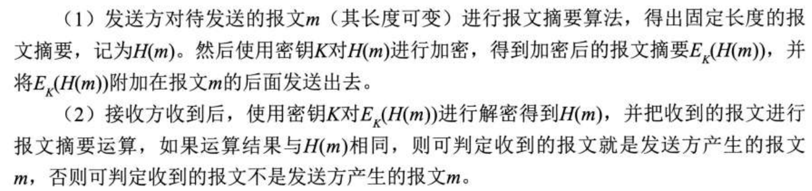
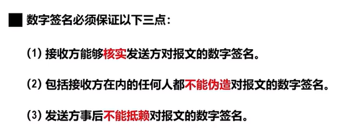
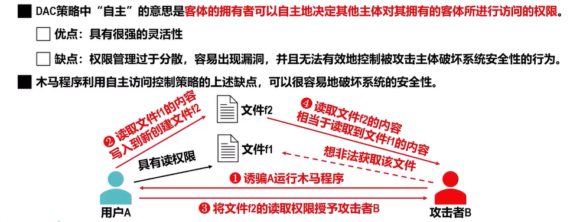
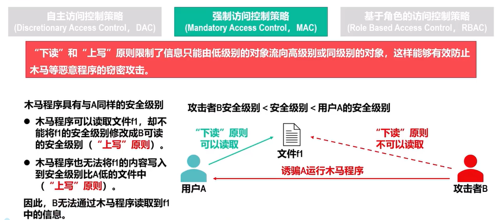
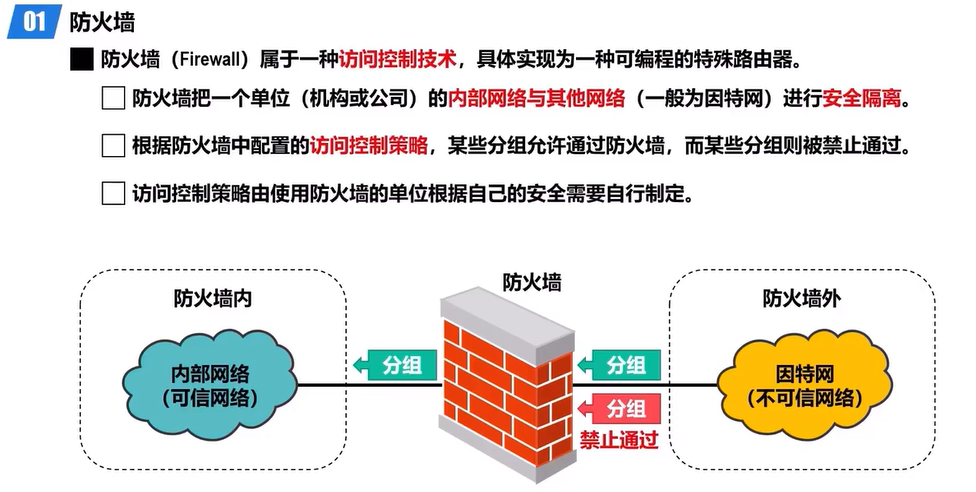
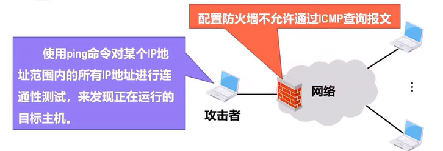
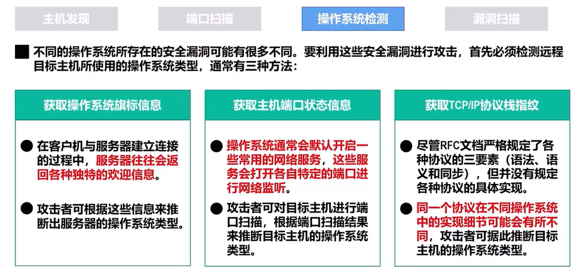

# 网络安全复试

## 1.网络安全概述

（1）计算机网络的安全机制有？

安全威胁、安全服务、安全机制

> 1.被动攻击与主动攻击

被动攻击：攻击者通过窃听手段仅观察和分析网络中传输数据流中的敏感信息，而不对其进行干扰。

主动攻击：攻击者会对网站中传输的数据流进行各种处理

对于被动攻击，由于不涉及对数据的更改，很难被发现。对付被动攻击主要采取各种数据加密技术进行预防，而不是主动检测。对于主动攻击容易检测，对付主动攻击除了要采取数据加密技术、访问控制技术等预防措施，还要采取各种检测技术及时发现并阻止攻击，同时还要发现攻击源进行追踪，并利用法律手段进行打击。

对网络安全危害较大的恶意病毒有

> 2.什么是拒绝服务DoS?

还有一种主动攻击，为拒绝服务DoS（Denial of Service）,攻击者向某个服务器发送大量的恶意请求，导致服务器繁忙，使得其他主机向该服务器发送正常请求时。

> 3.分布式拒绝服务攻击，被称为DDoS

该服务器因为繁忙，拒绝向该主机提供服务，攻击者也可以利用系统漏洞控制因特网上成百上千台主机，使他们成为僵尸主机，同时利用这些僵尸主机向某个服务器发送大量请求。导致该服务器瘫痪，当其他主机向该服务器发送正常请求时，该服务器因为瘫痪而拒绝向主机提供服务。

> 4.交换机毒化攻击

交换机中毒，也被称为交换机毒化攻击，攻击者发送大量伪造源MAC地址的帧，交换机收到每个帧进行自学习，将自己的伪造的源MAC地址写到自己的转发表中，由于这种伪造源MAC地址的帧数量巨大，因此很快就会被交换机的转发表被填满，导致交换机无法正常工作。

> 5.安全服务及其介绍

下面介绍安全服务，安全服务包括保密性、报文完整性、实体鉴别、不可否认性、访问控制、可用性。

## 2.密码学基础概念

为什么依靠密钥进行保密，不使用密码算法进行保密？

加密过程

加密的一般过程

## 3.对称密钥密码体制

对称密钥密码体制，是指"加密密钥"和"解密密钥"相同的密码体制。

> 1.DES的基本加密过程

DES全称为数据加密标准，为美国IBM公司研制发布，为对称密钥机密算法的典型代表，加密过程是将整个明文划分为若干64比特的数据，然后由56比特密钥和8比特奇偶校验位构成的64位比特密钥，分别对64比特的数据进行加密处理，产生若干个64位比特的密文，最后将这64位比特的密文串联起来，即可得到整个密文。DES的保密性仅取决于对密钥的保密和长度而算法是公开的。目前56比特DES已不再安全。

* 三重DES

  先使用密钥K1进行DES加密，然后再使用密钥K2进行DES解密，最后在使用密钥K3进行DES加密，最终得到密文。

> 2.介绍AES

AES全称位高级加密标准，属于对称密钥密码体制，支持128比特、192比特、256比特的密钥长度，采用分组加密方式，并进行 10 到 14 轮加密。相比 DES，它的安全性更高，因此广泛应用于 HTTPS、VPN 以及数据加密存储等领域。同时AES用硬件和软件均可以快速实现，不需要太多内存，因此适用于小型的移动设备。

## 4.公钥密钥密码体制

> 1.介绍公钥密钥密码体制

公钥密钥密码体制使用不同的加密密钥和解密密钥，加密密钥是向公众公开的称为公钥，解密密钥是需要保密的，称为私钥，加密算法E和解密算法D都是公开的。私钥由公钥决定，但通过公钥计算不出私钥。

> 2.RSA算法介绍

RSA算法属于公钥密钥加密体制，是基于数论中大素数分解算法的非对称加密算法，公钥加密，私钥解密。安全性高，但计算复杂度较大，因此在实际应用中常用于密钥交换、数字签名、身份认征，而不会直接用于大数据加密。

> 3.公钥密码体制与对称密钥密码体制比较哪个更好？

> 4.对比对称密钥密码体制与公钥密钥密码体制

**首先，说对称密钥加密。**
 对称加密使用 **同一个密钥** 进行加密和解密，比如 AES、DES。加密解密的速度快，但 **问题是密钥要事先共享**，一旦密钥泄露，数据也就不安全了。

**然后，说公钥加密。**
 公钥加密（非对称加密）用 **一对密钥（公钥和私钥）**，比如 RSA、ECC。公钥用来加密，私钥用来解密，只有持有私钥的人才能解密数据。这样即使公钥公开，别人也无法解密数据。

**对比来看，**

- **对称加密速度快，适合大数据加密**，但 **密钥分发困难**，密钥管理麻烦。
- **公钥加密更安全，不需要共享私钥**，但 **计算速度慢**，通常用于 **密钥交换和数字签名**，不会直接用于加密大量数据。

所以，在现实中，**两者通常结合使用**，比如在 HTTPS 里，用 **RSA（公钥加密）先加密对称密钥**，然后用 **AES（对称加密）加密数据**。

## 5.报文摘要和报文鉴别码

报文完整性与鉴别的概念

报文摘要与报文鉴别码

密码散列函数

有名的散列函数算法

> 1.MD5与SHA-1

散列报文鉴别码

## 6.数字签名

> 1.什么是数字签名

数字签名是一种基于 **公钥加密** 的安全技术，主要用于 **验证数据的完整性和身份认证**，防止数据被篡改或伪造。

它的（利用公钥密钥密码体制）工作原理是：
 **首先，** 发送方对数据进行 **哈希运算**，生成一个固定长度的摘要（比如用 SHA-256）。
 **然后，** 发送方用 **自己的私钥** 对这个哈希值加密，生成 **数字签名**，并和原始数据一起发送。
 **最后，** 接收方用 **发送方的公钥** 解密数字签名，并对接收到的数据重新计算哈希值，如果两者一致，说明数据完整且确实来自发送方，否则签名无效。

数字签名广泛应用于 **SSL/TLS 证书、电子合同、软件签名** 等场景，确保数据的安全性和可信性。

2.数字签名的实现

（1）对称密钥实现数字签名

发送方A首先使用自己的私钥SKA进行解密运算，即为用A的私钥对报文M进行数字签名，将数字签名的报文M发送给B，B收到带有数字签名的报文M后用A的公钥PKA对其进行加密运算，即为用A的公钥核实数字签名，即可得出原报文M

具有保密性的数字签名

发送方A将要发送的报文A使用自己的私钥进行解密进行数字签名，然后使用B的公钥进行加密，加密后的报文发送给接收方B，B显示有自己的私钥进行解密，然后再使用A的公钥进行加密来核实数字签名。

## 7.实体鉴别

实体鉴别的概念

> 1.重放攻击

攻击者C可以截获A发送给B的加密报文，C并不需要对该报文进行解密，而是以后将该报文发送给B，使得B使得接受方B认为C就是发送方A,B就向伪装成A的C发送大量本应发送给A的报文。

> 2.使用不重数与对称密钥密码体制来实现实体鉴别

用户A首先挑选一个随机的不重数RA,然后将自己的用户名与RA封装在一个报文中，发送给用户B,B收到后也挑选了一个不重数RB,然后用B自己的私钥SKB,对不重数RA进行数字签名，并将自己选择的不重数RB和签名后的不重数RA,封装在一个报文中发送给A作为响应，由于使用B的私钥SKB,对不重数RA进行了数字签名，所以，A收到后使用B的公钥PKB核实出不重数RA,这样A就验证了B的身份，A使用自己的私钥SKA签名B发出的不重数RB,然后将其封装在一个报文中发送给B,B收到后使用自己的公钥PKA核实出不重数RB,这样B就验证出了A的身份，在双方验证了身份后，就可以进行本次会话的数据传输了。

> 3.中间人攻击

## 8.密钥分发

1.对称密钥的分发

KDC的作用

## 9.访问控制

1.访问控制的基本概念

2.访问控制的基本要素

访问控制的著名模型

> 1.三种典型的访问控制策略

（1）自主访问控制策略

（2）强制访问控制策略

（3）基于角色的访问控制策略

## 10.物理层与数据链路层的安全实例

1.物理层信道加密机直接加密

2.数据链路层的安全实例

（1）SSID匹配机制

（2）MAC地址过滤机制

（3）有限等效保密机制

（4）802.11i的安全框架

## 11.网络层的安全实例IPsec

IPsec协议族的概述

> 1.IPsec的两种工作方式

目前使用最多的是隧道方式。

安全关联

举例1：两个主机之间使用SA通过隧道模式通信

举例2：主机与路由器之间通信

IPsec数据报的构成，即使用的主要协议

IPsec的报文格式

IPsec的其他构建

## 12.运输层的安全实例SSL/TLS

1.SSL/TLS的应用

> 1.SSL的三种安全服务

> 2.SSL/TLS的基本工作过程

首先浏览器向服务器发送一些可选的加密算法，服务器向这些加密算法中选择自己支持的加密算法告知浏览器，这一交互过程为加密算法协商。

然后，服务器向浏览器发送一个包含其公钥的数字证书，浏览器使用该证书的认证中心(CA)公开发发布的公钥验证该证书,浏览器产生一个秘密数，使用秘密数按照之前协商好的加密算法产生一个共享的对称会话密钥。

然后用服务器的公钥加密该秘密数并发送给服务器，服务器收到后使用自己的私钥解密出秘密数，然后使用秘密数按照之前协商好的加密算法产生共享的对称会话密钥。

服务器通知浏览器会话密钥已经产生完成，之和双方既可以通过会话密钥进行通信了。

## 13.应用层的安全实例PGP

1.PGP发送的加密过程

2.PGP接收的解密过程

## 14.防火墙控制访问与入侵检测系统

1.防火墙的作用

2.防火墙的简介

防火墙的两种应用路由器

1.分组过滤路由器

2.应用网关

防火墙的两种分类介绍

防火墙的局限性

入侵检测系统的介绍

## 15.常见的网络攻击与防范

### 1.网络扫描

可以故意发送错误的差错报告报文来确定主机是否在运行

2.端口扫描

3.操作系统检测

### 2.网络监听

### 3.拒绝服务攻击

